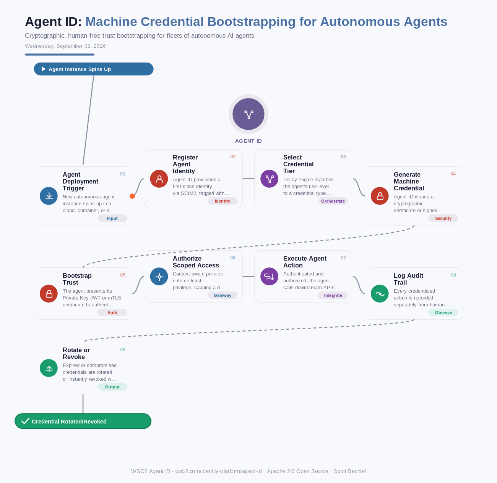

# Agent ID: Machine Credential Bootstrapping for Autonomous Agents
**Date:** Wednesday, September 09, 2026  **Product:** [Agent ID](https://wso2.com/identity-platform/agent-id/)

## Business Problem
Enterprises spinning up autonomous agents for trading, procurement, or DevOps automation can't rely on a human clicking through an OAuth login screen every time a new agent instance boots. Teams have been falling back on shared API keys and long-lived secrets baked into agent code or containers, which means one leaked key can expose every agent that shares it, with no way to tie the credential back to a specific agent's identity or intent.

## How WSO2 Solves This
WSO2 Agent ID treats every autonomous agent as a first-class identity from the moment it's provisioned, so credential bootstrapping never requires a human in the loop. Low-risk internal agents can start with simple API keys, while high-value or external-facing agents get cryptographic assurance through mutual TLS or Private Key JWT, all tied to metadata like owner, purpose, and risk level. Because trust is established through signed certificates and keys rather than shared secrets, a rotation or revocation on one agent never has to mean broad exposure across the fleet. That's the difference between agents that scale safely and a pile of copy-pasted API keys nobody can account for six months later.

## Patterns Used
- Mutual TLS (mTLS) Authentication
- Private Key JWT (RFC 7523)
- Zero-Trust Machine Identity
- Least-Privilege Authorization

## Architecture

---
WSO2 Agent ID · wso2.com/identity-platform/agent-id ·  by, Scott Bechtel
