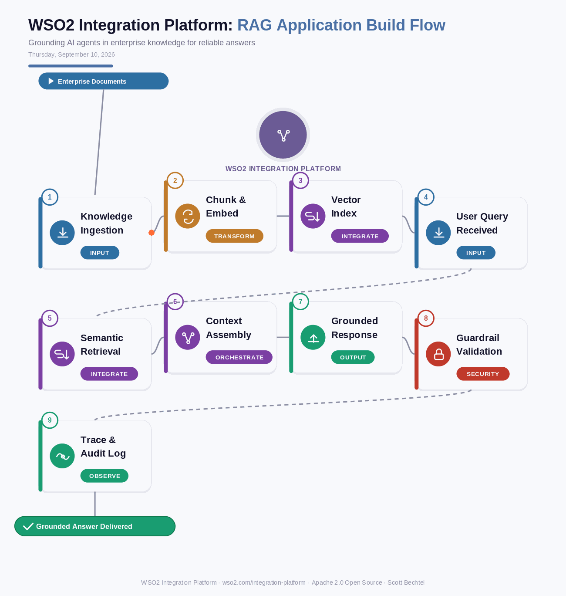

# WSO2 Integration Platform: RAG Application Build Flow
**Date:** Thursday, September 10, 2026  **Product:** [WSO2 Integration Platform](https://wso2.com/integration-platform/)

## Business Problem
Enterprise support and claims agents keep giving generic or flat-out wrong answers because they're disconnected from the documents that actually define how the business operates — product manuals, claims history, policy PDFs scattered across a dozen systems. Teams end up hand-rolling a vector database, an ingestion job, and a retrieval layer for every new agent, which turns a two-week pilot into a two-quarter integration project.

## How WSO2 Solves This
WSO2 Integration Platform builds RAG directly into the same flows you already use for APIs and events, instead of treating it as a separate AI project. Connectors from the 600+ library pull documents out of wikis, ERPs, and file shares, chunk and embed them, and land the vectors in an index the agent can query in real time. When a question comes in, the platform retrieves the relevant chunks, assembles them with policy and conversation context, and only then hands the prompt to the LLM — so the response is grounded in what the business actually says, not what the model guesses. Guardrails and full trace logging sit in that same path, so governance isn't bolted on after the fact.

## Patterns Used
- Retrieval-Augmented Generation (RAG)
- Vector Embedding Pipeline
- Semantic Search
- Context Grounding

## Architecture

---
WSO2 Integration Platform · wso2.com/integration-platform ·  by, Scott Bechtel
