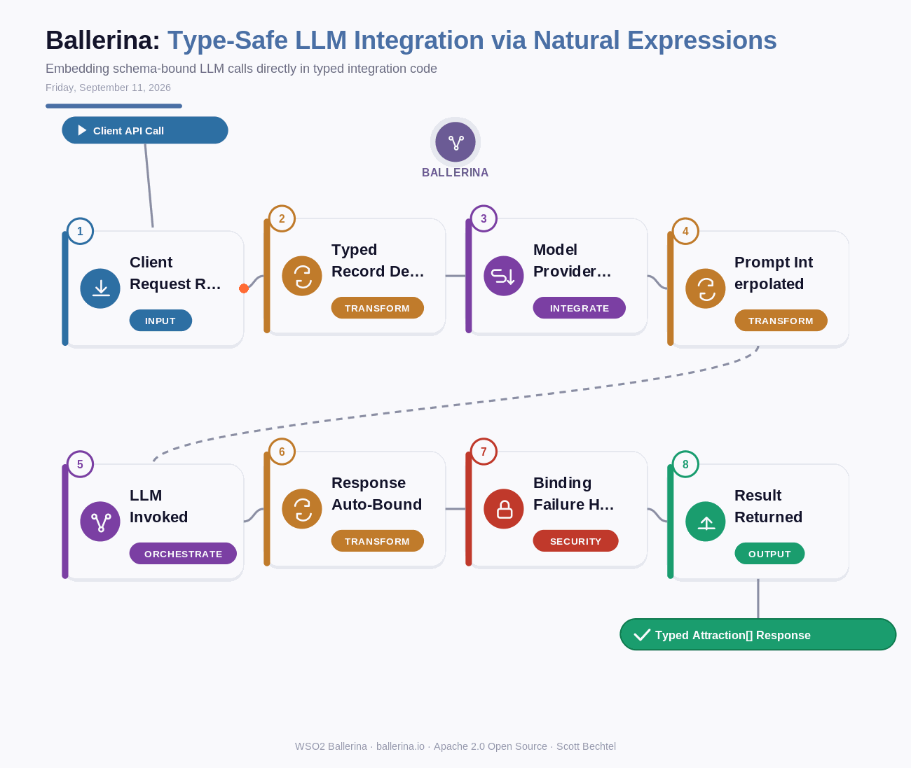

# Ballerina: Type-Safe LLM Integration via Natural Expressions
**Date:** Friday, September 11, 2026  **Product:** [Ballerina](https://ballerina.io/)

## Business Problem
Most LLM integrations turn into their own mini parsing layer — hand-rolled prompt strings, ad-hoc JSON parsing, and retry logic bolted on after the model returns something that doesn't quite match what the code expected. That brittleness tends to show up at the worst time: production, under load, when the model's output drifts slightly from the shape a downstream function assumed.

## How WSO2 Solves This
Ballerina's natural expressions let you write an LLM call as ordinary typed code instead of a side-channel API integration. Declare the record you want back, drop a `natural()` block with your instruction and interpolated variables, and the runtime sends the prompt along with the record's generated JSON schema, then binds the response straight into that type. No prompt-template library, no manual JSON parsing, no separate SDK — a bad or mismatched response fails as a typed error instead of silently corrupting data three services downstream.

## Patterns Used
- Schema-Constrained Generation
- Type-Safe Response Binding
- Model Provider Abstraction
- Fail-Fast Error Typing

## Architecture

---
WSO2 Ballerina · ballerina.io ·  by, Scott Bechtel
