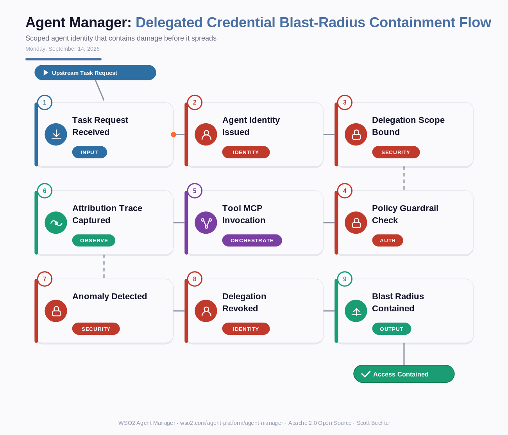

# Agent Manager: Delegated Credential Blast-Radius Containment Flow
**Date:** Monday, September 14, 2026  **Product:** [Agent Manager](https://wso2.com/agent-platform/agent-manager/)

## Business Problem
When agents act on behalf of users or other systems using borrowed or inherited credentials, enterprises lose attribution — they can't tell which agent, which invocation, or which downstream call caused an action. A single compromised or misbehaving agent can cascade damage through every system that shared credential touches, because traditional IAM treats agents as either human users or service accounts, neither of which limits what a delegated credential can reach or for how long.

## How WSO2 Solves This
WSO2 Agent Manager gives every agent its own first-class identity instead of a borrowed one, built on Agent ID with scoped delegation, fine-grained access policies, and instant revocation. Each delegated action carries its own token bound to task-specific scope and TTL, so if an agent misbehaves or gets compromised, WSO2 can revoke that one delegation instantly without touching the credentials the rest of the system depends on. Combined with OTEL-compatible tracing, every delegated call is attributed back to the exact agent, task, and invocation that made it — turning "which agent did this?" from a forensic exercise into a two-second trace lookup. It's containment by design, not incident response after the blast.

## Patterns Used
- Zero-Trust Delegation
- Scoped Credential Issuance
- Blast-Radius Containment
- Continuous Behavioral Evaluation

## Architecture

---
WSO2 Agent Manager · wso2.com/agent-platform/agent-manager ·  by, Scott Bechtel
