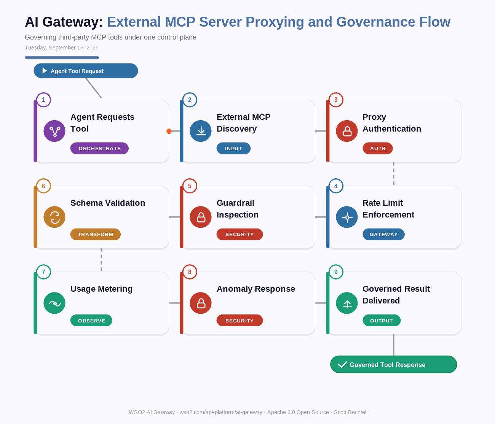

# AI Gateway: External MCP Server Proxying and Governance Flow
**Date:** Tuesday, September 15, 2026  **Product:** [AI Gateway](https://wso2.com/api-platform/ai-gateway/)

## Business Problem

Teams are plugging third-party MCP servers into their AI agents to unlock new capabilities fast, but each one shows up with its own auth scheme, its own rate limits, and no audit trail. A vendor's misbehaving server can pull excessive data, run up token costs, or vanish from a security review entirely. Companies need one place to vet, meter, and watch every external tool an agent touches, not a pile of one-off allowlists.

## How WSO2 Solves This

WSO2 AI Gateway proxies any external MCP server through the same control plane you already use for your APIs and LLM traffic, no custom wrapper code needed. Every call to that server passes through unified authentication, throttling, and AI guardrails before it reaches your agents, and tool-level usage shows up right next to your internal traffic in one view. Onboard a vendor's MCP server in minutes, hold it to the same policies as your own APIs, and cut it off instantly if it starts acting up. Trusting a vendor's server is one thing. Governing it is another.

## Patterns Used

- Reverse Proxy Pattern
- Zero Trust Security
- Circuit Breaker Pattern
- Centralized Policy Enforcement Point (PEP)

## Architecture

---
WSO2 AI Gateway · wso2.com/api-platform/ai-gateway ·  by, Scott Bechtel
