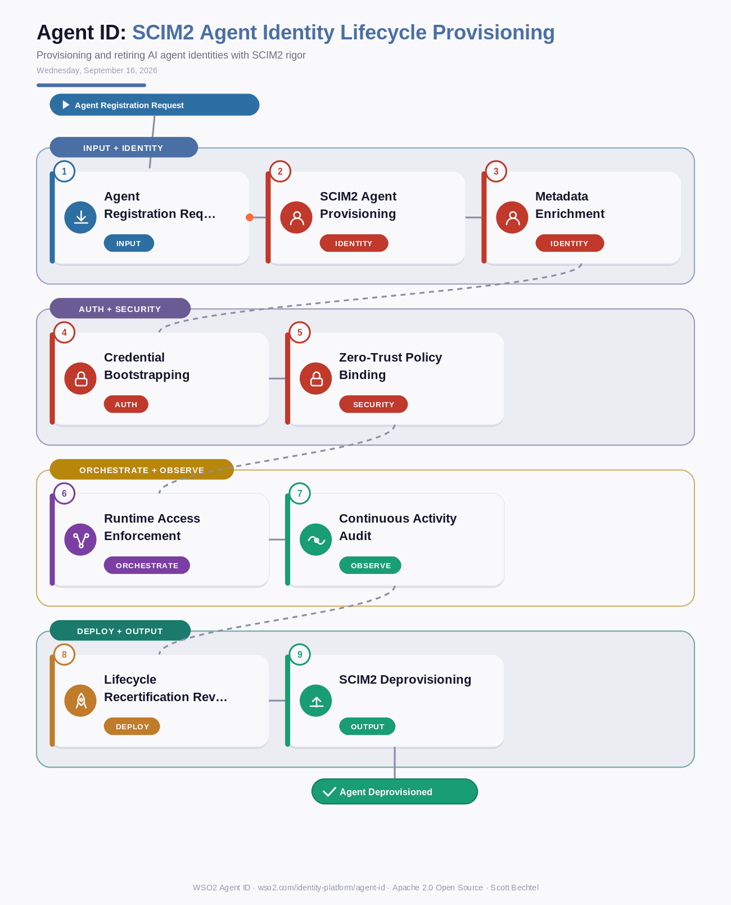

# Agent ID: SCIM2 Agent Identity Lifecycle Provisioning
**Date:** Wednesday, September 16, 2026  **Product:** [Agent ID](https://wso2.com/identity-platform/agent-id/)

## Business Problem
Enterprises are spinning up AI agents faster than their identity teams can track them — a data-analysis agent here, a procurement bot there — each one often hand-provisioned with a shared API key or forgotten once a project ends. Without a standard provisioning protocol, agent identities pile up outside the IAM system of record, so nobody can answer who owns an agent, what risk tier it's in, or whether it should still have access. When a sponsoring team disbands, the agent's credentials often just keep working.

## How WSO2 Solves This
WSO2 Agent ID treats every AI agent as a first-class identity, provisioned with the same rigor as a human employee using SCIM2 with agent-specific schema extensions instead of one-off scripts. Each agent record carries rich metadata — owner, purpose, risk level — captured at creation and enforced throughout its life, so authorization policies reference that context automatically. Deprovisioning is just as standardized: a single SCIM2 call revokes credentials and access the moment a project ends, leaving no orphaned service accounts behind. It's the same lifecycle discipline enterprises already trust for workforce identity, extended natively to autonomous agents.

## Patterns Used
- SCIM2 Provisioning Protocol
- Zero-Trust Identity
- Least-Privilege Authorization
- Immutable Audit Trail

## Architecture

---
WSO2 Agent ID · wso2.com/identity-platform/agent-id ·  by, Scott Bechtel
