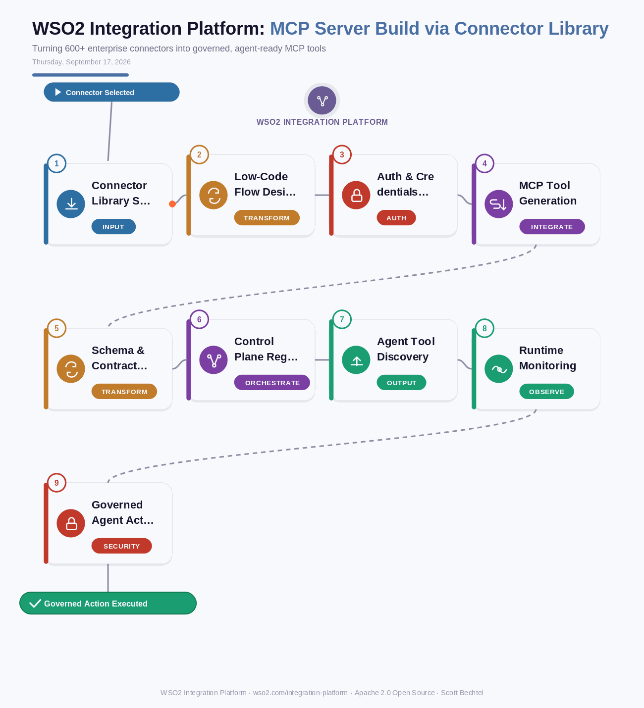

# WSO2 Integration Platform: MCP Server Build via Connector Library
**Date:** Thursday, September 17, 2026  **Product:** [WSO2 Integration Platform](https://wso2.com/integration-platform/)

## Business Problem
Enterprises want AI agents to reach into systems like SAP, Salesforce, and internal databases, but hand-coding an MCP server for every backend is slow and inconsistent. Every team ends up rebuilding the same auth handling, schema mapping, and error handling from scratch, and the resulting tools rarely match in quality or governance.

## How WSO2 Solves This
WSO2 Integration Platform's Integrator ships with a library of 600+ pre-built, EIP-compliant connectors covering SAP, Salesforce, databases, file systems, and more. Instead of writing bespoke MCP server code, a developer wires up a connector in the low-code or pro-code designer (both with full feature parity) and the platform generates an MCP server that exposes each operation as a typed, agent-callable tool. The new server registers with the platform's single control plane, so every call an agent makes is visible, monitored, and governed by the same guardrails and access policies as the rest of the integration landscape. What used to be months of custom integration work becomes a governed, repeatable flow that any MCP-compatible agent framework can consume.

## Patterns Used
- MCP (Model Context Protocol) Tool Exposition
- Contract-First Schema Mapping
- Centralized Control Plane Governance
- Low-Code/Pro-Code Parity

## Architecture

---
WSO2 Integration Platform · wso2.com/integration-platform ·  by, Scott Bechtel
