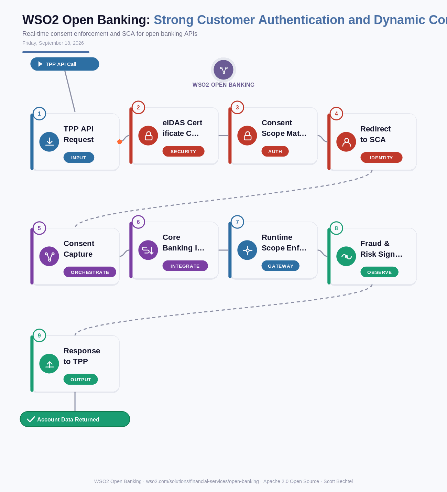

# Open Banking: Strong Customer Authentication and Dynamic Consent Management Flow
**Date:** Friday, September 18, 2026  **Product:** [Open Banking](https://wso2.com/solutions/financial-services/open-banking/)

## Business Problem
A bank exposing PSD2 or UK Open Banking APIs has to let a Third Party Provider request account or payment access, push the customer through Strong Customer Authentication, and capture a consent that's specific enough to hold up to a regulator - then keep enforcing that exact scope on every call for as long as the consent lives. Handle that by hand across security, compliance, and core banking, and you get gaps. Regulators find those gaps fast.

## How WSO2 Solves This
WSO2 Open Banking builds FAPI-certified security and OAuth2 with eIDAS certificate validation directly into the API layer, so consent capture, SCA, and per-call scope checks happen as part of the request instead of getting bolted on after the fact. A TPP call, a redirect for authentication, and a signed consent all flow through one policy engine, and every later call gets checked against the consent that's actually on file - not just the one from account opening day. It's built to track UK OBIE, PSD2, and CDR as they change, so a new regulatory version doesn't mean a rebuild.

## Patterns Used
- FAPI Security Profile
- OAuth 2.0 Redirect Flow
- Policy-Based Consent Enforcement
- mTLS Certificate Validation (eIDAS)

## Architecture

WSO2 Open Banking · wso2.com/solutions/financial-services/open-banking ·  by, Scott Bechtel
