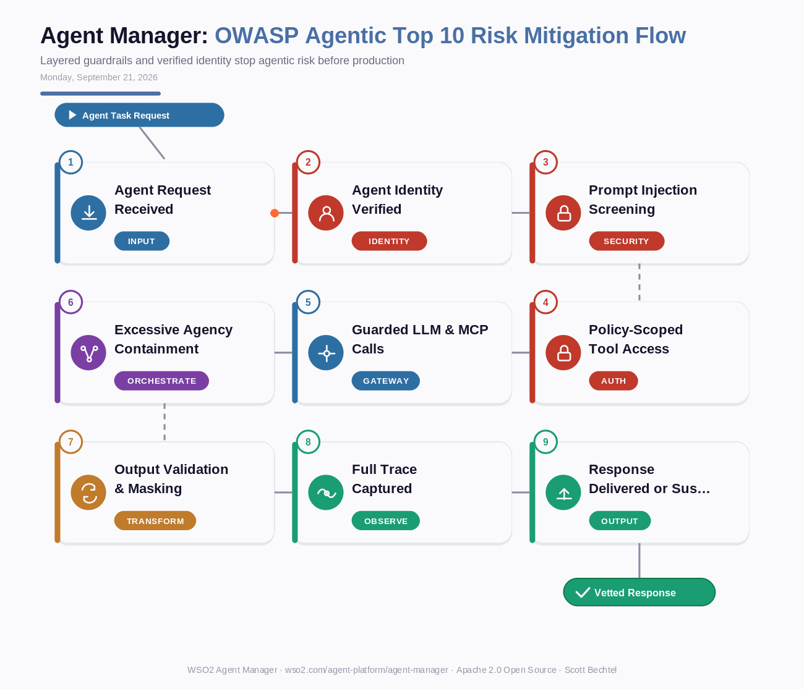

# Agent Manager: OWASP Agentic Top 10 Risk Mitigation Flow
**Date:** Monday, September 21, 2026  **Product:** [Agent Manager](https://wso2.com/agent-platform/agent-manager/)

## Business Problem

Security and platform teams can usually say which framework an agent runs on. They can rarely say which OWASP Agentic AI risks that agent is actually exposed to. Prompt injection, excessive agency, and quiet data leakage get handled ad hoc, if at all, because guardrails live in scattered scripts instead of one enforced layer. When an auditor asks how a specific risk is mitigated, most teams don't have a clean answer.

## How WSO2 Solves This

WSO2 Agent Manager closes that gap with 40+ built-in guardrails, including PII masking, URL and content validation, and semantic prompt validation, enforced at the organization, agent, MCP, and LLM level and mapped directly to the OWASP Agentic AI Top 10. The policy layer works the same way whether an agent runs on LangChain, CrewAI, AWS Strands, or Microsoft Agent Framework, so adopting a new framework doesn't mean rebuilding governance from scratch. OpenTelemetry tracing and built-in evaluations turn "we think it's fine" into a logged, defensible answer, and a single click suspends any agent that trips a guardrail.

## Patterns Used

- Zero-Trust Agent Identity
- Defense-in-Depth Guardrails (org / agent / tool / LLM layers)
- Sandbox Containment Pattern
- OpenTelemetry Distributed Tracing

## Architecture

---
WSO2 Agent Manager · wso2.com/agent-platform/agent-manager ·  by, Scott Bechtel
