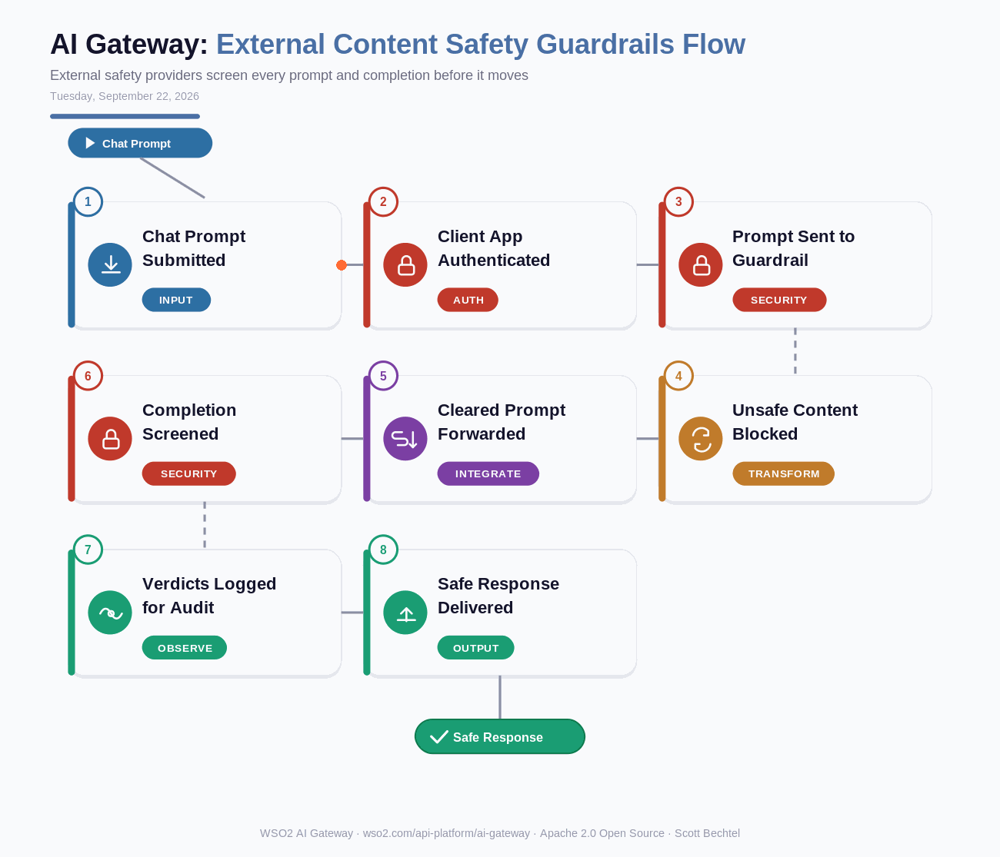

# AI Gateway: External Content Safety Guardrails Flow
**Date:** Tuesday, September 22, 2026  **Product:** [AI Gateway](https://wso2.com/api-platform/ai-gateway/)

## Business Problem

A bank's LLM-based support agent can't risk an unsafe or non-compliant answer reaching a customer, and building an in-house content moderation model that keeps pace with new jailbreak patterns eats a security team's whole quarter. Compliance also wants an audit trail proving every prompt and response got screened, without every microservice bundling a vendor SDK just to make an LLM call.

## How WSO2 Solves This

WSO2 AI Gateway plugs a third-party safety provider like Azure AI Content Safety or AWS Bedrock Guardrails straight into the request and response path. No SDK in your app code, no separate service to run. Every prompt gets checked before it reaches the model, every completion gets checked before it reaches the user, and the pass, block, or redact verdict lands in the same log stream as your API traffic. Swap providers or stack a second one later without touching a single line of application code.

## Patterns Used

- Policy Enforcement Point (PEP)
- Fail-Closed Guardrail Pattern
- Bidirectional Content Filtering (prompt + completion)
- Provider-Agnostic Guardrail Abstraction

## Architecture

WSO2 AI Gateway · wso2.com/api-platform/ai-gateway ·  by, Scott Bechtel
