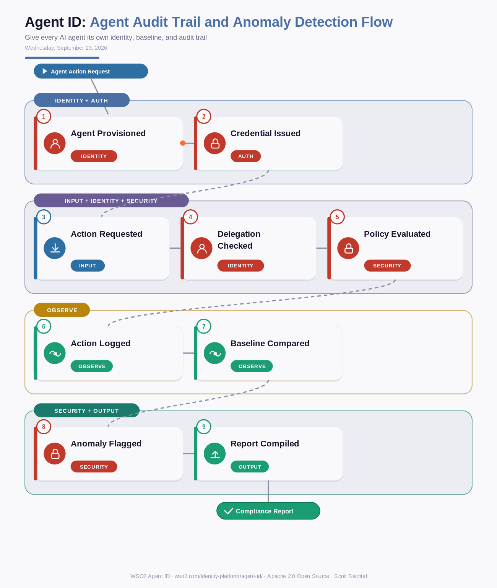

# Agent ID: Agent Audit Trail and Anomaly Detection Flow
**Date:** Wednesday, September 23, 2026  **Product:** [Agent ID](https://wso2.com/identity-platform/agent-id/)

## Business Problem
A procurement agent with standing access to your ERP and payment systems starts placing orders outside its normal pattern - 3am timestamps, first-time vendors, amounts nobody approved. Buried inside generic system logs next to every human transaction, that pattern is invisible. Security teams have no baseline for the agent's normal behavior and no fast way to prove who authorized what, and when, after the fact.

## How WSO2 Solves This
WSO2 Agent ID gives every AI agent its own identity instead of folding its actions into a shared service account. Each agent's actions carry its owner, purpose, risk level, and delegation chain, so security teams can set a real behavioral baseline for that agent's role. When an agent drifts from it, Agent ID flags the deviation and keeps every action in an immutable, agent-specific trail - the kind of record AI-accountability regulations now expect.

## Patterns Used
- Zero-Trust Agent Authentication
- Delegated Authorization Chain
- Behavioral Baseline Anomaly Detection
- Immutable Audit Trail

## Architecture

WSO2 Agent ID · wso2.com/identity-platform/agent-id/ ·  by, Scott Bechtel
