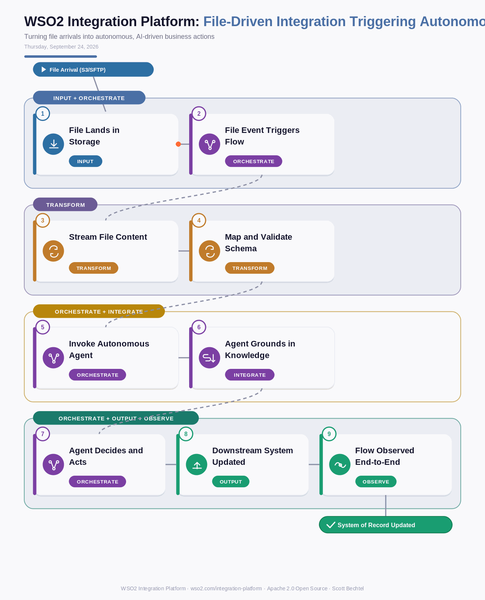

# WSO2 Integration Platform: File-Driven Integration Triggering Autonomous Agents
**Date:** Thursday, September 24, 2026  **Product:** [WSO2 Integration Platform](https://wso2.com/integration-platform/)

## Business Problem

Enterprise data still lands as messy files — EDI batches from trading partners, CSV drops in an S3 bucket, flat files off a mainframe — and most integration tools just move those files around without understanding what's inside them. That leaves someone on a team checking folders, eyeballing content, and manually deciding what happens next, which means delays on B2B orders and no way to catch exceptions before they become a partner's problem.

## How WSO2 Solves This

WSO2 Integration Platform treats a file landing in S3, Blob storage, or an SFTP folder as a real business event, not a batch job to poll for. The moment a file appears, a streaming parser picks it apart safely, gigabytes at a time, and hands the parsed content straight to an AI agent built into that same flow. The agent reasons over the data against your enterprise knowledge base and decides what to do next — route it, flag it, write it to a system of record — all without anyone opening a folder to check. Since it's 600+ connectors and 100% open source under one control plane, you get this without stitching together separate file-transfer and RPA tools.

## Patterns Used

- Event-Driven Architecture
- Streaming ETL
- Retrieval-Augmented Generation (RAG)
- Straight-Through Processing

## Architecture

---
WSO2 Integration Platform · wso2.com/integration-platform ·  by, Scott Bechtel
