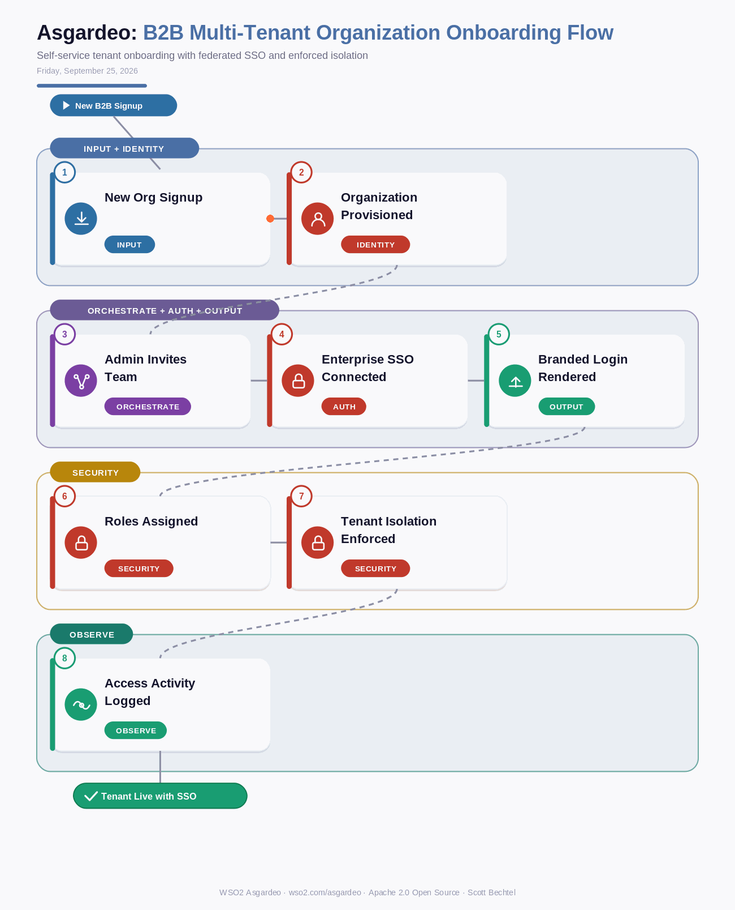

# Asgardeo: B2B Multi-Tenant Organization Onboarding Flow
**Date:** Friday, September 25, 2026  **Product:** [Asgardeo](https://wso2.com/asgardeo/)

## Business Problem

A B2B SaaS vendor signs a new enterprise customer, and now needs to give that customer's admin a private user directory, team invites, and their own SSO connection, without touching the codebase or spinning up new infrastructure. Handling this manually per customer burns engineering time on every deal, and any mistake in tenant isolation risks one customer's users seeing another customer's data. Sales wants new tenants live in hours, not sprints.

## How WSO2 Solves This

Asgardeo turns tenant onboarding into an API call instead of a project. Each new customer gets its own organization with an isolated user pool, so team invites, role assignments, and enterprise SSO connections stay scoped to that org automatically. Drop-in UI components like SignIn and UserProfile render the branded experience without custom frontend work, and because isolation is enforced by the platform, you're not writing tenant-boundary checks by hand. It's the difference between selling to enterprises and actually being ready to onboard them.

## Patterns Used

- Multi-Tenant Isolation Pattern
- Federated SSO (SAML/OIDC)
- Role-Based Access Control (RBAC)
- Drop-In Component Pattern

## Architecture

---
WSO2 Asgardeo · wso2.com/asgardeo ·  by, Scott Bechtel
