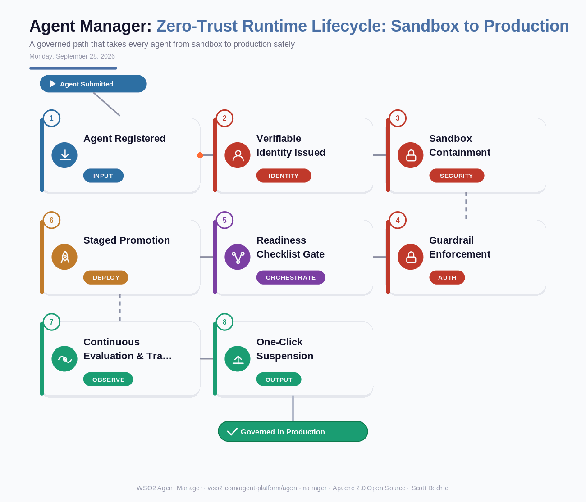

# Agent Manager: Zero-Trust Runtime Lifecycle — Sandbox to Production
**Date:** Monday, September 28, 2026  **Product:** [WSO2 Agent Manager](https://wso2.com/agent-platform/agent-manager/)

## Business Problem
Enterprise teams push agent code from a laptop straight into a customer-facing workflow because there's no consistent way to test containment before granting real access. When something goes wrong, the only lever is pulling the whole integration, since no single agent identity or scoped permission exists to isolate the blast radius. Security teams end up learning about a new agent from an incident report instead of a deployment record.

## How WSO2 Solves This
WSO2 Agent Manager gives every agent a versioned path from development to staging to production, gated by the same readiness checklist every time, so "ready to ship" stops being a one-off debate. Each agent runs sandboxed under its own verifiable identity and delegation policy, so a compromised or misbehaving agent can be suspended with a single click instead of taking down the whole integration. Guardrails mapped to the OWASP Agentic Top 10 enforce policy at the organization, agent, MCP, and LLM level before anything reaches a customer, and end-to-end OpenTelemetry tracing plus built-in evaluations give audit questions a defensible, logged answer.

## Patterns Used
- Zero Trust Security
- Staged Promotion Pipeline (Dev → Staging → Production)
- Sandbox Isolation Pattern
- Circuit Breaker / Kill Switch

## Architecture

---
WSO2 Agent Manager · wso2.com/agent-platform/agent-manager ·  by, Scott Bechtel
