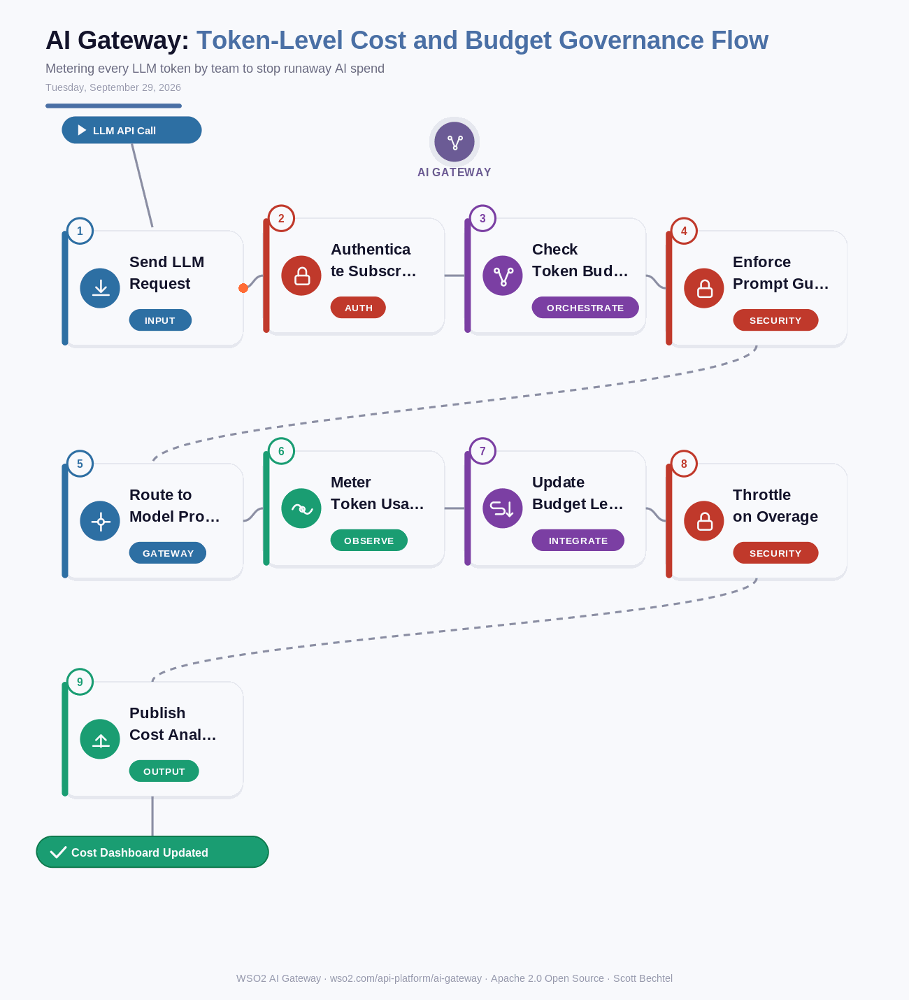

# AI Gateway: Token-Level Cost and Budget Governance Flow
**Date:** Tuesday, September 29, 2026  **Product:** [AI Gateway](https://wso2.com/api-platform/ai-gateway/)

## Business Problem
Give five teams API keys to GPT-4o or Claude and by the second week nobody can say which one is burning the budget. A runaway agent loop, or just an app that got popular, can blow through a month's LLM spend in an afternoon, and finance only finds out when the invoice lands.

## How WSO2 Solves This
WSO2 AI Gateway meters every prompt and completion token by team and application, not just by API key, so you can see exactly where the spend is going before the bill shows up. Set a monthly budget per team, and the gateway throttles or blocks calls the moment they cross it, no waiting on a human to notice. Usage and cost data flow straight into Moesif-powered analytics, so finance gets real chargeback numbers instead of a shared invoice and a shrug.

## Patterns Used
- Token Bucket Rate Limiting
- Circuit Breaker Pattern
- Policy Enforcement Point (PEP)
- Chargeback Metering Pattern

## Architecture

---
WSO2 AI Gateway · wso2.com/api-platform/ai-gateway ·  by, Scott Bechtel
