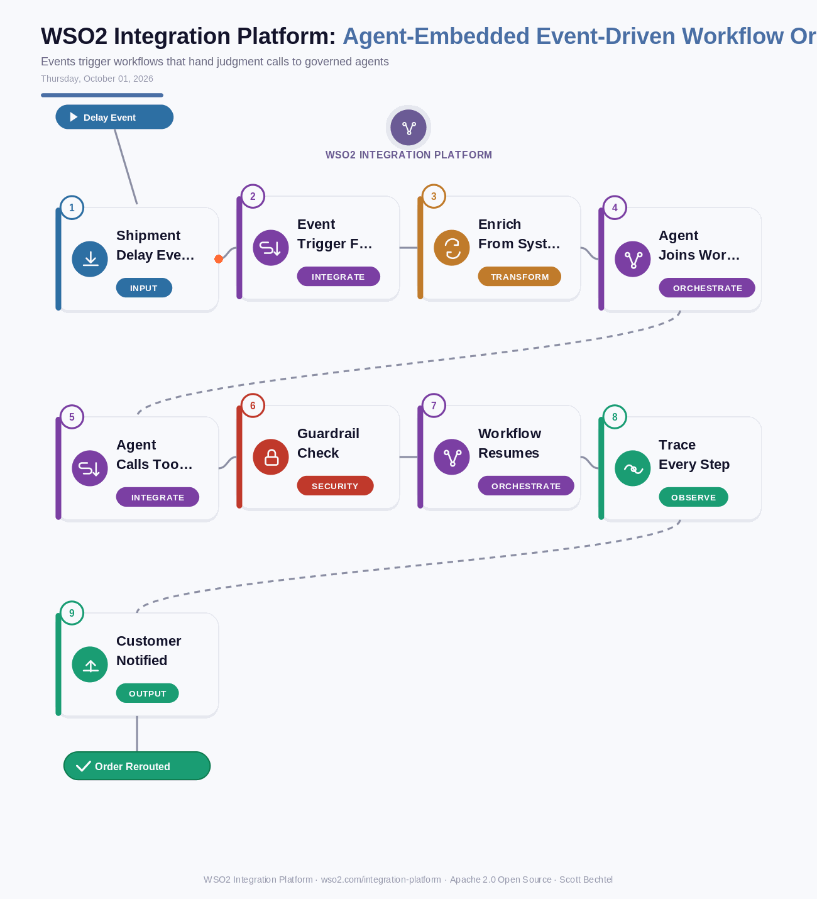

# WSO2 Integration Platform: Agent-Embedded Event-Driven Workflow Orchestration
**Date:** Thursday, October 01, 2026  **Product:** [WSO2 Integration Platform](https://wso2.com/integration-platform/)

## Business Problem
Most integration teams already run event-driven flows: a carrier delay lands on a broker, a workflow fires, a few systems get updated. The trouble starts when the event needs judgment. Today that means a human reads a ticket, or someone hard-codes a hundred if-statements that rot the first time a contract changes.

## How WSO2 Solves This
WSO2 Integration Platform lets you drop an AI agent into the middle of an event-driven workflow instead of bolting it on the side. The event triggers the flow, connectors from the 600+ library enrich the case, and the agent gets only the models, knowledge bases, and tools you hand it. Deterministic steps do the rest once the decision is approved. Because it is one platform, with low-code and pro-code parity, the whole run is traceable from the first event to the last customer notification.

## Patterns Used
- Event-Driven Architecture
- Agent-in-the-Loop Workflow
- Policy Enforcement Point (PEP)
- Content Enricher (EIP)

## Architecture

WSO2 Integration Platform · wso2.com/integration-platform ·  by, Scott Bechtel
