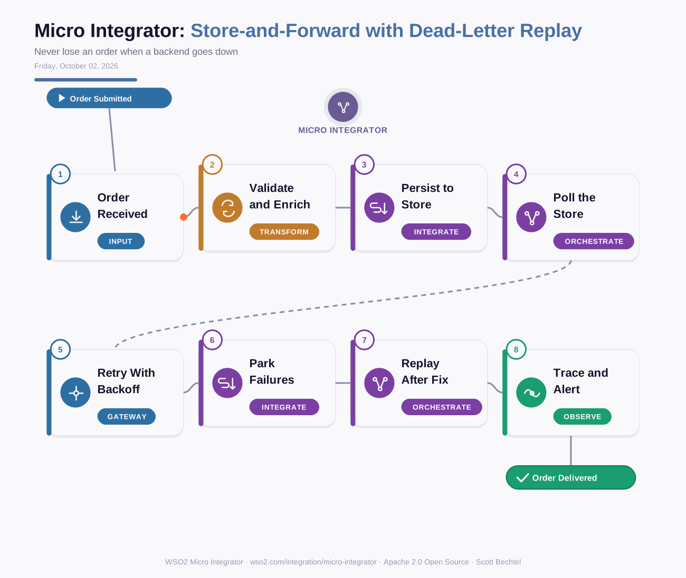

# Micro Integrator: Store-and-Forward with Dead-Letter Replay
**Date:** Friday, October 02, 2026  **Product:** [Micro Integrator](https://wso2.com/integration/micro-integrator/)

## Business Problem
An order service posts to a fulfillment backend that goes down for forty minutes every few weeks. Callers time out, retries pile up, and someone ends up re-keying orders from logs. The integration layer has no memory of what it accepted, so a backend outage turns into lost revenue.

## How WSO2 Solves This
The Micro Integrator accepts the order, validates it, and writes it to a message store before it answers the caller. A message processor then drains that store at a rate the backend can handle, retrying with backoff and failing over to a secondary endpoint. Messages that run out of retries move to a dead-letter store with the failure reason attached. Once the backend is fixed, you replay them in their original order. Nothing is dropped, and the caller never waits on a slow system.

## Patterns Used
- Store-and-Forward (Guaranteed Delivery)
- Dead Letter Channel
- Retry with Exponential Backoff
- Endpoint Failover

## Architecture

WSO2 Micro Integrator · wso2.com/integration/micro-integrator ·  by, Scott Bechtel
