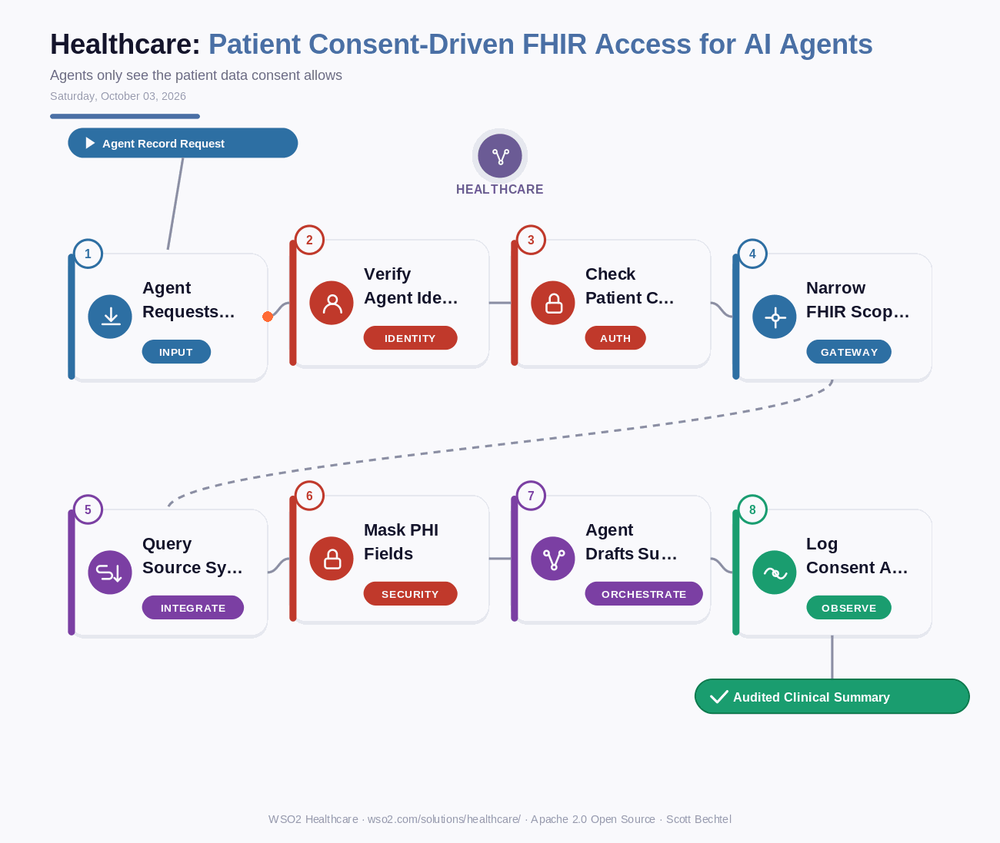

# Healthcare: Patient Consent-Driven FHIR Access for AI Agents
**Date:** Saturday, October 3, 2026  **Product:** [Healthcare](https://wso2.com/solutions/healthcare/)

## Business Problem
Hospitals want AI agents summarizing charts and chasing prior-auth paperwork, but those agents tend to get a broad service account and read far more of the record than the task needs. A patient who agreed to share lab results with one app has not agreed to have an agent read their medication and claims history. Compliance teams end up blocking the pilot because nobody can prove what the agent saw.

## How WSO2 Solves This
Every agent request goes through the FHIR API layer with a real identity behind it. Agent ID authenticates the agent and ties it to an owner, then the patient's consent record decides which resources and purposes are in play. The gateway narrows the token to those SMART on FHIR scopes, connectors pull from the EHR, lab, and claims systems, and guardrails mask PHI the task does not need before the model sees any of it. Each access lands in an audit trail with the agent, the patient, the purpose, and the consent version, so you can answer "what did it see and why" later.

## Patterns Used
- Consent-Based Access Control
- SMART on FHIR Scoped Authorization
- Data Minimization with PHI Masking
- Zero Trust Security

## Architecture

---
WSO2 Healthcare · wso2.com/solutions/healthcare/ · by Scott Bechtel
